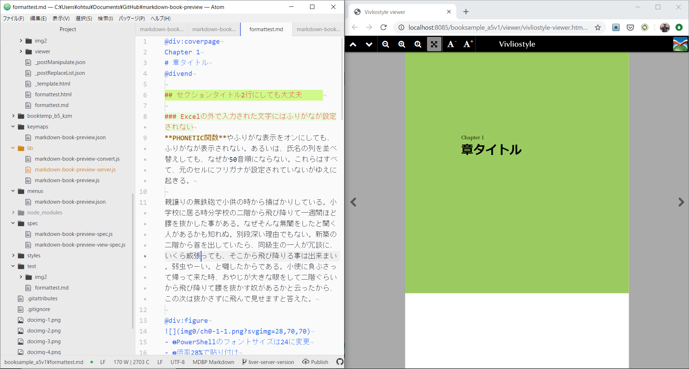
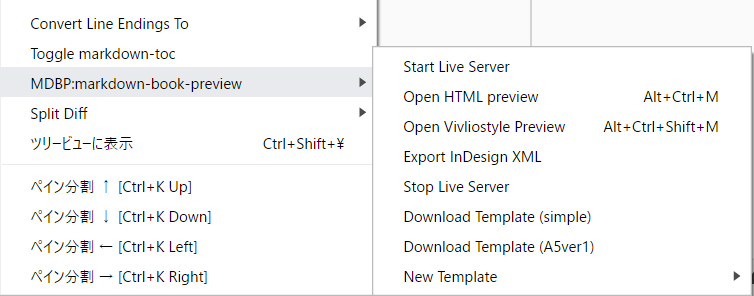
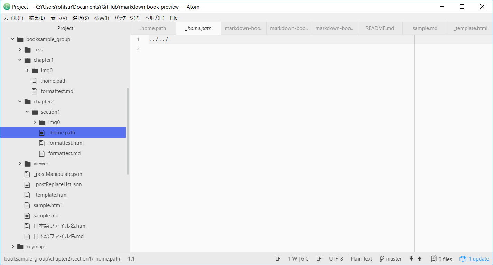

# MDBP: atom-markdown-book-preview
書籍の原稿作成に適したMarkdownプレビューのAtomパッケージです。
Vivliostyle Viewerと組み合わせて書籍の体裁で表示し、原稿データをInDesign向けのXMLファイルとして書き出す機能を持ちます。

## 特徴
- 任意の組版用CSSを読み込める
- 置換リストを使用してHTML変換後にテキスト置換を行える。これはMarkdownの不足を補うために使用する
- 画像ファイル名にsvgimgという拡張指定を追加すると、スクリーンショットの拡大縮小やトリミングが行える
- HTMLを実ファイルとして書き出すので、簡易的なHTML生成ツールとしても使用できる
- Vivliostyle Viwerを使用した書籍プレビューが可能
- ファイルの更新を監視してプレビューを更新するため、別のテキストエディタで作業しビューワとしてのみ使うことも可能
- InDesignで読み込み可能なXMLを書き出せる

### Version 2.0
Atomの仕様変更でペイン内にプレビューを表示することが難しくなったため、[Live Server](https://www.npmjs.com/package/live-server)を組み込み、
Webブラウザ（Chromeを推奨）にプレビューを表示する方式に変更しました。プレビューを表示した状態で、Markdownファイルなどを上書き保存すると、Webブラウザ側のプレビューを自動更新（ライブリロード）します。

Atomの「フォルダーを開く」機能で開いているフォルダー内の全ファイル（PDFファイルのみ除外）を監視するため、編集中のMarkdownファイル以外を更新してもプレビューが自動更新されます。



## 操作方法
［パッケージ］メニューから実行


右クリックメニューから実行



### Start Live Server / Stop Live Server
Live Serverを起動／終了します。

### Open HTML preview
CSSを適用したHTMLをVivliostyleを使わずに表示します。


### Open Vivliostyle Preview
Vivliostyleを使って書籍風に表示します。Markdownファイルが保存されたフォルダ内にVivliostyle Viewerのviwerフォルダを配置しておく必要があります。


- Vivliostyle Viewerのダウンロード
https://vivliostyle.org/download/

### Print PDF
PDFを書き出します。現状ではWebブラウザの印刷機能を利用するので、Webブラウザのウィンドウを表示するのみです。印刷機能でPDF保存を選び、余白を「なし」にして保存してください。

Ver.2.0ではWebブラウザにプレビューを表示する方式になったため、この機能は廃止されました。PDFの書き出し方法は同じです。

### Export InDesign XML
InDesignの［構造］パネルで読み込み可能なXMLファイルを書き出します。XMLタグを任意のスタイルとマッピング可能です。また、画像のリンクを活かした自動配置、InDesign上のスクリプトと組み合わせた表の自動作成が可能です。

## プレビューの動作に必要なファイルについて
テンプレートファイルのダウンロード機能を追加しました（2018/01/09）。コンテキストメニューなどから［Download Template］を選択すると、`_template.html`、`_postReplaceList.json`、`css/booksample.css`の3ファイルをダウンロードします。テンプレートファイルをはじめて使うときの叩き台としてお使いください。

### テンプレートファイル
任意のCSSを読み込むために、`_template.html`という名前のテンプレートファイル内でCSSのリンクを指定する必要があります。Markdownファイルと同じフォルダ内に`_template.html`が存在しない場合、このパッケージは動作しません。

```html
<!doctype html>
<html>
  <head>
    <title>doc</title>
    <link rel="stylesheet" href="_css/_kyouhon.css">
  </head>
  <body>
<%=content%>
  </body>
</html>
```


### 置換リスト
置換リストは`_postReplaceList.json`というJSONファイル内に記述します。

以下の置換リストは「@div クラス名」と「@divend」で囲んだ範囲を、div要素に置換します。また、ハイフンで生成する水平線は改ページ指定として処理します。
```
[
    {
        "f": "@div:([a-z|0-9 ]+)",
        "r": "<div class=\"$1\">"
    },
    {
        "f": "@divend",
        "r": "<\/div>"
    },
    {
        "f": "<hr>",
        "r": "<hr class=\"pagebreak\">"
    },
……後略……
```

### 画像のトリミング
IT書でスクリーンショットは欠かせません。いちいちグラフィックスソフトでトリミングしたり、拡大縮小率を厳密に指定するのは手間なので、画像ファイル名のあとに簡単な指示を入れることで、指定できるようにしました。

```


?svgimg=倍率,横幅mm,高さmm,横シフト量mm,縦シフト量mm
```

倍率以外のパラメータは省略可能です。幅と高さは省略時なりゆき、シフト量は0となります。

### その他
ゲタ文字〓を使用して連番を自動生成できます。

## グループモード
~~複数人で執筆する際に原稿をフォルダ分けすることを想定して、`_template.html`や`_cssフォルダ`を一カ所にまとめられるようグループモードを追加しました。Markdownファイルと同じ階層に_home.pathというフォルダを配置し、その中に「../../」というようにホームディレクトリまでの相対パスを指定します。あとは通常通りにプレビューを表示するだけです。~~

~~ディレクトリ構成は以下の画像を参考にしてください。~~

Ver.2.0より、同階層にviewerフォルダがない場合は、上の階層に向けて自動探索するように仕様変更しました。`_home.path`ファイルは必要なくなりました。

<!--  -->

## postManipulate（後操作）機能
まだまだ実験的な機能ですが、Markdownをいじらずにデザイン都合でHTML構造を自動変更する機能を追加しました。見出しのデザインを凝ったものにするために、@div:secheader～@divendといったタグ風のレイアウト指示コードを入れる仕様としていますが、Markdownの標準ルールから離れてしまい、記述が面倒になるという問題があります。そこで、jQueryに似た機能を持つcheerioというライブラリを利用し、h2とpが並んでいたらdiv要素で囲むよう機能を追加しています。

操作内容は_postManipurate.jsonというファイルに「セレクタ」「メソッド」「パラメータ」を指定する形にしているので、プロジェクトごとに設定変更が可能です。
```
[
  {
    "selector": "h1",
    "method": "wrapWithNextSib",  // h1要素とその次の1要素をdiv.coverpageでラップする（見出しとリード文のグループ化）
    "paramator": "<div class=\"coverpage\"></div>"
  },
  {
    "selector": "h2",
    "method": "wrap",     // h2要素をdiv.secheaderでラップする（h2要素に装飾用のdivを追加）
    "paramator": "<div class=\"secheader\"></div>"
  },
    "selector": "h3",
    "method": "wrapAll",  // h3要素の直後にある複数のp要素をすべてdiv.col2でラップする（見出しの下の段落を2段組みに）
    "paramator": ["p", "<div class=\"col2\"></div>"]
  },
  {
    "selector": "h2",
    "method": "dupRunning",  // h2要素のテキストを複製してspan.header2という要素を作成する（柱テキストの作成）
    "paramator": "<span class=\"header2\"></span>"
  },
    "selector": "p code",
    "method": "addClass",  // p要素内のcode要素にinline_codeというクラスを追加する
    "paramator": "inline_code"
  },
]
```

## CSSの自動読み込み機能（version 2.3.xで追加）
ファイルごとにCSSを切り替える需要が出てきたため、Markdownファイルと同名のCSSファイルがあれば自動的に読み込むようにしました。
例えば「chap1.md」であれば、「chap1.css」を探し、存在したらHTMLファイルにlink要素を追加して読み込みます。

これを利用すると、章ごとにツメや柱の位置を動かすことなどができます（章の数だけCSSを書くのは若干面倒ですが）。
また、前付け／後付けのみ他と書式を変えることも可能になります。

## ブックモード（version 2.2あたりで追加）
「maeduke.md」というファイルをVivliostyleプレビューで表示した場合、ビューワーのURLに「`&bookMode=True'」を付けます。
これによりViviostyleビューワーのブックモードが有効になり、目次のnav要素内に記述されたHTMLファイルを順番に読み込んで、1つのブックとしてレンダリングします。
この機能を利用しないと、全体でページを通すことができません。


(c)libroworks.co.jp
http://libroworks.co.jp/
