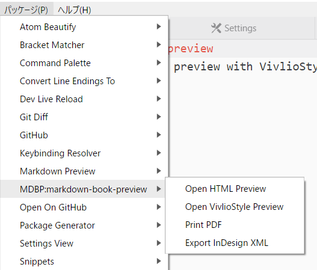
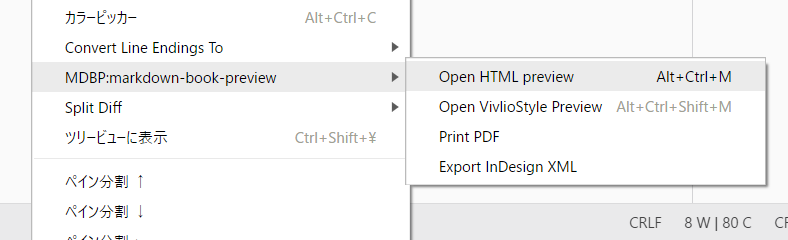
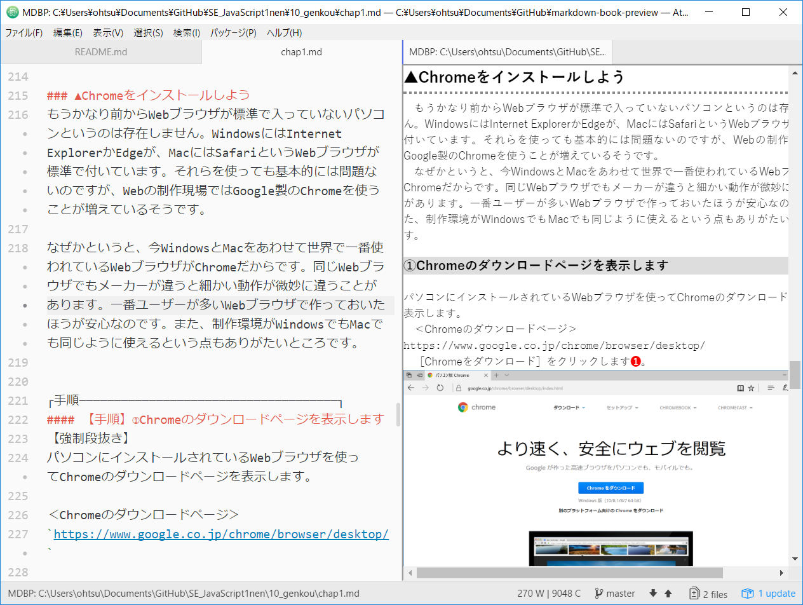
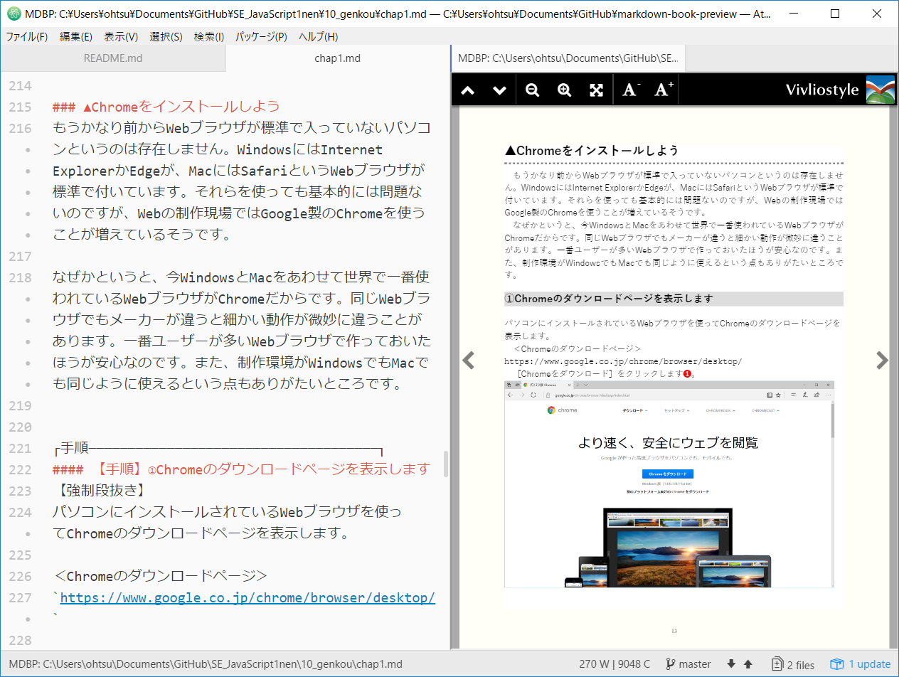

# MDBP: atom-markdown-book-preview
書籍の原稿作成に適したMarkdownプレビューのAtomパッケージです。
VivlioStyle Viewerと組み合わせて書籍の体裁で表示し、原稿データをInDesign向けのXMLファイルとして書き出す機能を持ちます。

## 特徴
- 任意の組版用CSSを読み込める
- 置換リストを使用してHTML変換後にテキスト置換を行える。これはMarkdownの不足を補うために使用する
- 画像ファイル名にsvgimgという拡張指定を追加すると、スクリーンショットの拡大縮小やトリミングが行える
- HTMLを実ファイルとして書き出すので、簡易的なHTML生成ツールとしても使用できる
- VivlioStyle Viwerを使用した書籍プレビューが可能
- ファイルの更新を監視してプレビューを更新するため、別のテキストエディタで作業しビューワとしてのみ使うことも可能
- InDesignで読み込み可能なXMLを書き出せる


## 操作方法
［パッケージ］メニューから実行



右クリックメニューから実行



### Open HTML preview
CSSを適用したHTMLをVivlioStyleを使わずに表示します。



### Open VivlioStyle Preview
VivlioStyleを使って書籍風に表示します。Markdownファイルが保存されたフォルダ内にVivlioStyle Viewerのviwerフォルダを配置しておく必要があります。


- VivlioStyle Viewerのダウンロード
http://vivliostyle.com/ja/products/#secProducts-download

### Print PDF
PDFを書き出します。現状ではWebブラウザの印刷機能を利用するので、Webブラウザのウィンドウを表示するのみです。印刷機能でPDF保存を選び、余白を「なし」にして保存してください。

### Export InDesign XML
InDesignの［構造］パネルで読み込み可能なXMLファイルを書き出します。XMLタグを任意のスタイルとマッピング可能です。また、画像のリンクを活かした自動配置、InDesign上のスクリプトと組み合わせた表の自動作成が可能です。

## プレビューの動作に必要なファイルについて
### テンプレートファイル
任意のCSSを読み込むために、`_template.html`という名前のテンプレートファイル内でCSSのリンクを指定する必要があります。Markdownファイルと同じフォルダ内に`_template.html`が存在しない場合、このパッケージは動作しません。

```html
<!doctype html>
<html>
  <head>
    <title>doc</title>
    <link rel="stylesheet" href="_css/_kyouhon.css">
  </head>
  <body>
<%=content%>
  </body>
</html>
```


### 置換リスト
置換リストは`_postReplaceList.json`というJSONファイル内に記述します。

以下の置換リストは「@div クラス名」と「@divend」で囲んだ範囲を、div要素に置換します。また、ハイフンで生成する水平線は改ページ指定として処理します。
```
[
    {
        "f": "@div:([a-z|0-9 ]+)",
        "r": "<div class=\"$1\">"
    },
    {
        "f": "@divend",
        "r": "<\/div>"
    },
    {
        "f": "<hr>",
        "r": "<hr class=\"pagebreak\">"
    },
……後略……
```

### その他
ゲタ文字〓を使用して連番を自動生成できます。

## 予定
- テンプレートファイルや置換リスト、組版用CSSの生成を支援するために、見本をダウンロードする機能の追加
- svgimgによる倍率とトリミング指定をGUIで行えるようにする機能の追加

(c)libroworks.co.jp
http://libroworks.co.jp/
